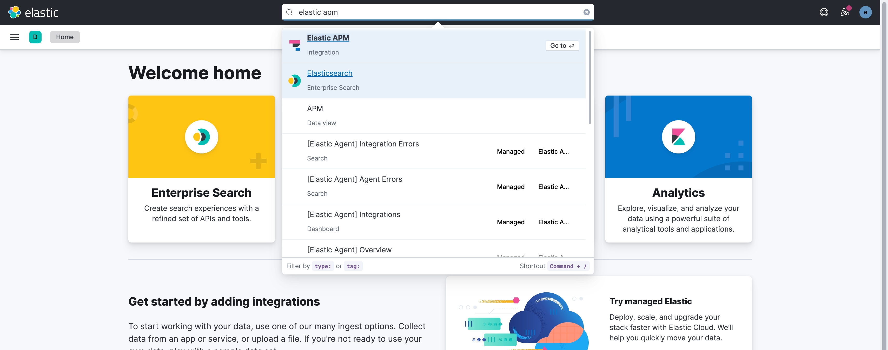
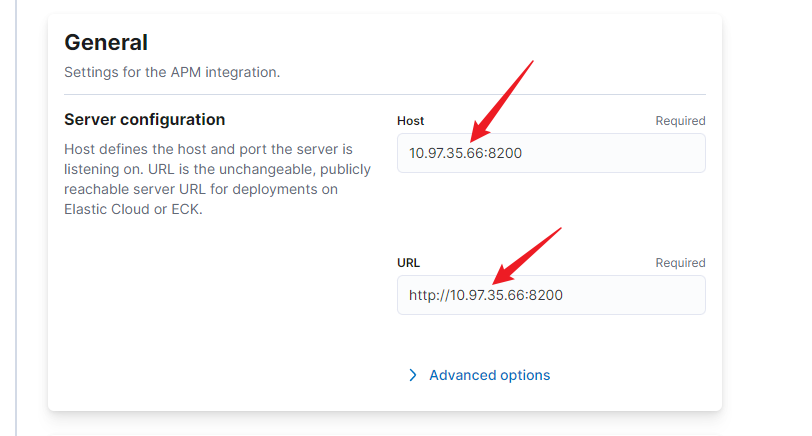
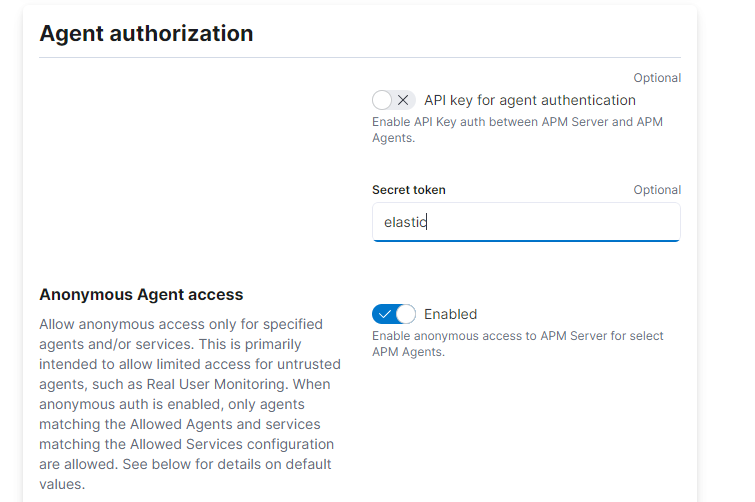

# MicroServo

## 简介

MicroServo 是一个为微服务系统设计的综合基准测试框架，通过三种数据收集模式（日志、追踪和性能指标）、自定义的故障注入以及支持在线算法部署的能力，为研究人员和开发者提供了一个实用的工具。该框架使用户能在模拟的生产环境中生成、监控和诊断各种故障场景，同时测试和开发新算法。


## 目的
MicroServo 的主要目的是提高微服务系统的弹性和效率。通过提供详细的故障模拟和数据收集工具，MicroServo 让研究人员和工业界从业者可以在控制的环境下评估和优化他们的系统和算法，确保微服务架构的稳定性和可扩展性。

## 功能
- 数据监控：MicroServo 能够从微服务系统中自动收集日志、追踪和性能指标数据，并将其处理成标注好的数据集，便于分析和模型训练。
- 故障注入：用户可以自定义故障类型和参数，利用 MicroServo 进行故障注入，以测试系统的恢复能力和故障检测算法的效果。
- 算法在线部署：MicroServo 支持用户上传和部署自定义算法，实现在线算法测试和调整，提高研发效率和算法性能。

## 安装部署

### 集群
1. 安装集群管理工具及相关依赖

执行`doc_addons`下的`1.install_dep.sh`，安装`minikube`,`docker`,`kubectl`,`helm`

```
bash 1.install_dep.sh
```
> 如果遇到系统问题或网络问题执行命令失败，可自行安装以上工具

2. 使用`minikube`部署单节点集群

执行`doc_addons`下的`2.deploy_instance.sh`，部署`minikube`集群

```
bash 2.deploy_instance.sh
```

> 可自行调整脚本中`minikube`的相关配置 \
> 如果需要配置代理，可以执行`2.deploy_instance_proxy.sh`脚本

安装完成后，执行`minikube --profile your_profile_name status`，即可验证`minikube`集群是否部署成功
> 运行`minikube ssh`可以登录集群虚拟机

### 观测工具
1. 安装`mysql`

docker安装mysql镜像，其中：容器名称 mysql-container 密码 your_password，建议使用mysql5.7版本

```SQL
docker run -d --name mysql-container -e MYSQL_ROOT_PASSWORD=elastic -p 3306:3306 mysql:5.7
```

然后修改mysql的字符集配置，然后重启`mysql`

> 若使用 `mysql：5.7`及以上版本，还需要修改`sql_mode`，使其支持空值

2. 创建`chaos_mesh`数据库

```Bash
docker exec -it mysql-container bash
mysql -u root -pelastic
CREATE DATABASE chaos_mesh;
```

3. 执行`doc_addons`下的`3.observatory.sh`，安装`apm-server`,`elasticsearch`,`filebeat`,`logstash`,`prometheus`,`chaosmesh`,`kibana`,`istio`

首先修改脚本中`dashboard.env.DATABASE_DATASOURCE`字段，填入步骤1中的ip和端口号

```
bash 3.observatory.sh
```

> 运行`kubectl get pods -n observe`, `kubectl get pods -n istio-system`即可查看安装情况

4. 执行端口转发

执行`doc_addons`下的`5.port_forward.sh`，将`elasticsearch`,`prometheus`,`chaosmesh`,`kibana`的端口映射到服务器的端口

`elasticsearch`为9200, `prometheus`为9090, `chaosmesh`为2333, `kibana`为5601

> 若有冲突可自行更换

```
bash 5.port_forward.sh
```

5. 为`elasticsearch`添加`elastic apm`

- 在kibana搜索框内搜索elastic apm


   
- 配置 APM-server 的 IP
    
执行`kubectl get svcs -n observe`查看apm-server的IP



- 配置secret：（注意，请将secret设置为`elastic`，请勿修改为其他值）



### 微服务系统

1. 构建镜像

修改`make-docker-images.sh`中的`REPO_PREFIX`为自己的`docker`仓库

执行`onlineboutique/hack`下的`make-docker-images.sh`，构建不同微服务的镜像

```
bash make-docker-images.sh
```

2. 部署微服务

修改`faultinjectionplatform/helm-chart/values.yaml`文件，将`images.repository`和`images.tag`修改为步骤1中的内容

在`faultinjectionplatform`下执行

```
helm install onlineboutique -n default ./helm-chart
```

> 执行`kubectl get pods`查看安装情况

### 后端

1. 创建`conda`环境

修改`platform_backend`下`environment.yml`中的`prefix`字段，改为想要取的新环境名称

```
conda env create -f environment.yml
conda activate XXXX
```

2. 创建数据库

```Bash
docker exec -it mysql-container bash
mysql -u root -pelastic
CREATE DATABASE work;
```

3. 配置django与mysql的连接

在`platform_backend/platform_backend/settings.py`文件下，更改配置信息

```Python
DATABASES = {
    'default': {
        'ENGINE': 'django.db.backends.mysql',
        'NAME': 'work',
        'USER': 'root',
        'PASSWORD': 'elastic',
        'HOST': 'mysql_container_ip', # 需要自己修改
        'PORT': '3306',
    }
}
```

4. 修改`config.yaml`中的`prometheus`和`elasticsearch`的url

5. 运行以下命令来应用数据库的表结构迁移：

```Bash
python manage.py migrate
```

6. 运行django服务器：

```Bash
python manage.py runserver 0.0.0.0:Your_port
```
### 前端

1. 配置好`node`和`npm`

2. 修改`platform_frontend/config/index.js`中`target`字段，为`Your_port`

3. 在`platform_frontend`下执行

```
npm install
npm run dev
```

## 可能的问题

### kibana代理配置

kibana在内网部署时，有可能需要配置代理
> 1. 在 kibana.yml 中添加 xpack.fleet.registryProxyUrl
>     kibanaConfig:
>     kibana.yml: |
>           xpack.fleet.registryProxyUrl: "your-nat-gateway.corp.net"
> 2. 在 extraEnvs 中添加 NOD_EXTRA_CA_CERTS
>     NODE_EXTRA_CA_CERTS="/etc/kibana/certs/ca-cert.pem"

### 镜像构建的代理问题

在创建镜像之前，如果是在内网环境中，还需要对镜像源进行替换。可以通过脚本方式对dockerfile进行修改。

但是如果服务器配置了代理，可以在每个微服务的dockerfile里添加代理，如果构建时还是发现镜像无法拉取，则再选择替换源。